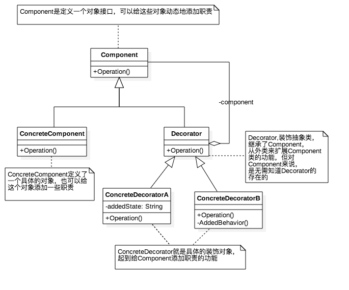
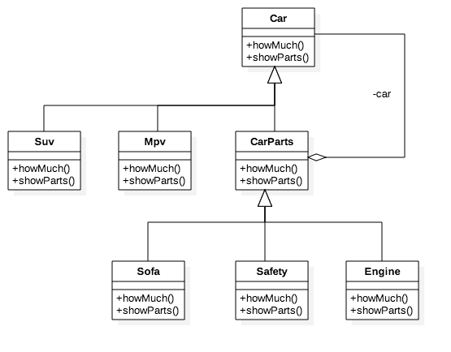

# 装饰模式

在不必改变原类文件和使用继承的情况下，动态地扩展一个对象的功能。它是通过创建一个包装对象，也就是装饰来包裹真实的对象。

## 装饰模式的特点

1. 装饰对象和真实对象有相同的接口。这样客户端对象就能以和真实对象相同的方式和装饰对象交互。
2. 装饰对象包含一个真实对象的引用（reference）
3. 装饰对象接受所有来自客户端的请求。它把这些请求转发给真实的对象。
4. 装饰对象可以在转发这些请求以前或以后增加一些附加功能。这样就确保了在运行时，不用修改给定对象的结构就可以在外部增加附加的功能。在面向对象的设计中，通常是通过继承来实现对给定类的功能扩展。

## 装饰模式的基本实现



上图是最基本的装饰模式的结构图，下面将用swift代码来实现一个基本装饰模式：

1）.先写一个Component接口

```swift
protocol Component {
    func operation()
}
```

2）.写一个具体的Component对象

```swift
class ConcreteComponent: Component {
    func operation() {
        // 具体操作的实现
    }
}
```

3）.写一个装饰抽象类

```swift
class Decorator: Component {
    var component: Component?
    func operation() {
        component?.operation()
    }
}
```

4）.写具体的装饰对象

```swift
// 装饰对象A
class ConcreteDecoratorA: Decorator {
    private var addedState: String?
    override func operation() {
        super.operation()
        addedState = "ConcreteDecoratorA独有的功能，用来区分ConcreteDecoratorB"
        // 具体装饰对象A的操作
    }
}
// 装饰对象B
class ConcreteDecoratorB: Decorator {
    override func operation() {
        super.operation()
        addedBehavior()
        // 具体装饰对象B的操作
    }
    // ConcreteDecoratorB独有的方法，用来区分ConcreteDecoratorA
    private func addedBehavior() {
        
    }
}
```

通过以上代码我们就能简单了解装饰模式的基本实现于过程，它的主要的目的就是：**在不必改变原类文件和使用继承的情况下，动态地扩展一个对象的功能**，就像以上示例代码一样，通过`ConcreteDecoratorA`与`ConcreteDecoratorB`去扩展`ConcreteComponent`这个对象的功能，这样不用去改变`ConcreteComponent`这个类的源文件，也可以达到扩展的效果。

## 用装饰模式解决实际问题（买车选配的问题）

下面通过一个实际的例子来看看，比如我们在买车的时候一般会选配很多配件，下面我们通过策略模式来实现这一过程，下上个结构图：



下面贴上代码：

```swift
// Component
protocol Car {
    // 多少钱
    func howMuch()-> Int
    // 展示装配的配件
    func showParts()
}

// ConcreteComponents
class Suv: Car {
    init(owner: String) {
        print("\(owner)买了一辆Suv，10W")
    }
    
    func howMuch() -> Int {
        return 10
    }
    
    func showParts() {}
}

class Mpv: Car {
    init(owner: String) {
        print("\(owner)买了一辆Mpv，15W")
    }
    func howMuch() -> Int {
        return 15
    }
    func showParts() {}
}

// Decorator
class CarParts: Car {
    var car: Car?
    func howMuch() -> Int {
        return car?.howMuch() ?? 0
    }
    func showParts() {
        car?.showParts()
    }
    func decorator(_ car: Car) -> Car {
        self.car = car
        return self
    }
}

// ConcreteDecorators 
class Sofa: CarParts {
    override func howMuch() -> Int {
        return super.howMuch() + 1
    }
    override func showParts() {
        super.showParts()
        print("选配了真皮沙发，1W")
    }
}

class Safety: CarParts {
    override func howMuch() -> Int {
        return super.howMuch() + 3
    }
    
    override func showParts() {
        super.showParts()
        print("选配了全套安全系统，3W")
    }
}

class Engine: CarParts {
    override func howMuch() -> Int {
        return super.howMuch() + 5
    }
    override func showParts() {
        super.showParts()
        print("选配了V8发动机，5W")
    }
}
```

下面我们使用一下以上代码看看：

```swift
//wcl买一辆suv
var suv: Car = Suv(owner: "wcl")
//装配沙发
suv = Sofa().decorator(suv)
//装配发动机
suv = Engine().decorator(suv)
//装配安全系统
suv = Safety().decorator(suv)
suv.showParts()
print("一共花了\(suv.howMuch())W")
print("\n")
//wcl买一辆mpv
var mpv: Car = Mpv(owner: "wcl")
//装配发动机
mpv = Engine().decorator(mpv)
//装配安全系统
mpv = Safety().decorator(mpv)
mpv.showParts()
print("一共花了\(mpv.howMuch())W")
```

以下是代码打印的结果：

```swift
wcl买了一辆Suv，10W
选配了真皮沙发，1W
选配了V8发动机，5W
选配了全套安全系统，3W
一共花了19W

wcl买了一辆Mpv，15W
选配了V8发动机，5W
选配了全套安全系统，3W
一共花了23W
```

这样就用装饰模式简单了实现了一下这个过程，在不改变`Suv`于`Mpv`这两个类的源文件的情况下对它进行操作。

## 总结

我们先看看装饰模式的优点：

1. 可以将类中装饰功能从类中搬出移除，这样可以简化原有的类
2. 有效的将核心职责和装饰功能区分开来，而且可以除去相关类中重复的装饰逻辑

装饰模式的缺点：

1. 装饰模式虽然扩展性较高，类的数量略多，如何取舍可扩展性和简洁性是个问题，有所选择就要有所牺牲
2. 很难搞清楚一个类究竟被装饰了多少层，可能是1层，也可能是100层

>以上是我对于策略模式的理解，如果有不对的地方欢迎大家交流，最后谢谢大家的阅读~~