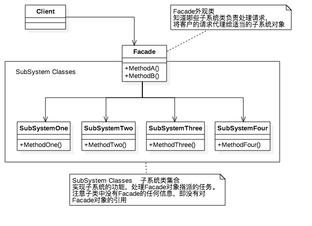
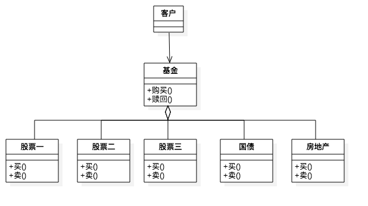

# 外观模式

外观模式（Facade），为子系统中的一组接口提供一个一致的界面，定义一个高层接口，这个接口使得这一子系统更加容易使用。

## 外观模式的基本实现



上图是外观模式的UML图，下面是基本的代码实现过程：

```swift
//MARK: 外观类
class Facade {
    let one   = SubSystemOne()
    let two   = SubSystemTwo()
    let three = SubSystemThree()
    let four  = SubSystemFour()

    public func methodA() {
        print("方法组A")
        one.methodOne()
        two.methodTwo()
        three.methodThree()
    }
    
    public func methodB() {
        print("方法组B")
        two.methodTwo()
        three.methodThree()
        four.methodFour()
    }
}


//MARK: 子系统类
class SubSystemOne {
    public func methodOne() {
        print("子系统方法一")
    }
}

class SubSystemTwo {
    public func methodTwo() {
        print("子系统方法二")
    }
}

class SubSystemThree {
    public func methodThree() {
        print("子系统方法三")
    }
}

class SubSystemFour {
    public func methodFour() {
        print("子系统方法四")
    }
}
```

## 外观模式解决实际问题（购买基金）

在生活中很多地方也用到外观模式，比如购买基金，我们从基金机构那里购买基金，然后他们帮我们管理我们的基金，去操作和运行，我们只管购买和卖出就行了，而不用去管他们内部的操作，下面是UML图和具体实现：



```swift
/// 基金类
class Fund {
    var gu1 = Stock1()
    var gu2 = Stock2()
    var gu3 = Stock3()
    var nd  = NationalDebt()
    var rt  = Realty()

    public func buyFund() {
        print("买入基金")
        gu1.buy()
        gu2.buy()
        gu3.buy()
        nd.buy()
        rt.buy()
    }
    
    public func shellFund() {
        print("\n卖出基金")
        gu1.shell()
        gu2.shell()
        gu3.shell()
        nd.shell()
        rt.shell()
    }
}

//股票类
class Stock1: Deal {
    var dealName: String {
        return "股票一"
    }
}

class Stock2: Deal {
    var dealName: String {
        return "股票二"
    }
}

class Stock3: Deal {
    var dealName: String {
        return "股票三"
    }
}

class NationalDebt: Deal {
    var dealName: String {
        return "国债"
    }
}

class Realty: Deal {
    var dealName: String {
        return "房地产"
    }
}

protocol Deal {
    var dealName: String {get}
    mutating func shell()
    mutating func buy()
}

extension Deal {
    mutating func shell() {
        print("\(dealName)卖出")
    }
    
    mutating func buy() {
        print("\(dealName)买入")
    }
}
```

 下面我们调用一下代码：

```swift
let jijin = Fund()
// 基金购买
jijin.buyFund()
// 基金赎回
jijin.shellFund()
```

下面是调用的结果：

```swift
买入基金
股票一买入
股票二买入
股票三买入
国债买入
房地产买入

卖出基金
股票一卖出
股票二卖出
股票三卖出
国债卖出
房地产卖出
```

以上就是简单的外观模式的实现，定义高层接口，基金的买入和卖出，去使用整个基金系统，而不用去管内部是怎么操作的。

## 外观模式的优点

（1）实现了子系统与客户端之间的松耦合关系。

（2）客户端屏蔽了子系统组件，减少了客户端所需处理的对象数目，并使得子系统使用起来更加容易。

