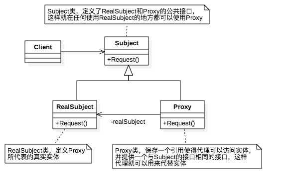

# 代理模式

代理模式为其他对象提供一种代理以控制对这个对象的访问，在某些情况下，一个对象不适合或者不能直接引用另一个对象，而代理对象可以在客户端和目标对象之间起到中介的作用。

## 代理模式的组成

- **抽象角色**：通过接口或抽象类声明真实角色实现的业务方法。
- **代理角色**：实现抽象角色，是真实角色的代理，通过真实角色的业务逻辑方法来实现抽象方法，并可以附加自己的操作。
- **真实角色**：实现抽象角色，定义真实角色所要实现的业务逻辑，供代理角色调用。

## 代理模式的基本实现



上图是最基本的代理模式的结构图，下面将用**Swift**代码来实现一个基本代理模式：

```swift
// 定义一个接口
protocol Subject {
    func request()
}


class RealSubject: Subject {
    func request() {
        print("真实的请求")
    }
}

class Proxy: Subject {
    // 真实的对象
    var realSubject: RealSubject?
    
    func request() {
        realSubject?.request()
    }
}
```

以上是一个最基本的代理模式的构成，这样可以用`Proxy`来代替`RealSubject`，从而对客户端隐藏真实的对象。

## 代理模式解决实际问题（快递于淘宝卖家的关系）

在生活中很多地方存在着代理模式，比如淘宝卖家与快递的问题，我们买东西需要淘宝卖家进行配送，但是其实他们并没有配送的功能，实际上是由快递公司进行的配送，淘宝就相当于快递公司的代理，买家也不用关心淘宝卖家是怎么送货过来的，下面是大概的实现方式：

```swift
// 定义一个配送的接口
protocol Deliver {
    var goodsName: String { get }
    func deliverGoods()
}

// 快递公司继承配送的接口
class Express: Deliver {
    var goodsName: String
    
    init(goodsName: String) {
        self.goodsName = goodsName
    }
    
    func deliverGoods() {
        print("由顺丰快递配送\(goodsName)")
    }
}

// 淘宝卖家也继承配送的接口
class Taobao: Deliver {
    // 实际上是由快递公司配送
    var express: Express
    var goodsName: String
    
    init(goodsName: String) {
        express = Express(goodsName: goodsName)
        self.goodsName = goodsName
        print("买了一个\(goodsName)")
    }
    
    func deliverGoods() {
        express.deliverGoods()
    }
}
```

下面我们使用一下以上代码看看：

```swift
let tb = Taobao(goodsName: "电脑")
tb.deliverGoods()
```

下面是打印结果：

```swift
买了一个电脑
由顺丰快递配送电脑
```

## 代理模式的优点

1. 职责清晰，真实的角色就是实现实际的业务逻辑，不用关心其他非本职责的事务，通过后期的代理完成一件完成事务，附带的结果就是编程简洁清晰。
2. 代理对象可以在客户端和目标对象之间起到中介的作用，这样起到了中介的作用和保护了目标对象的作用。
3. 高扩展性

> 以上是我对于代理模式的理解，如果有不对的地方欢迎大家交流，最后谢谢大家的阅读~~